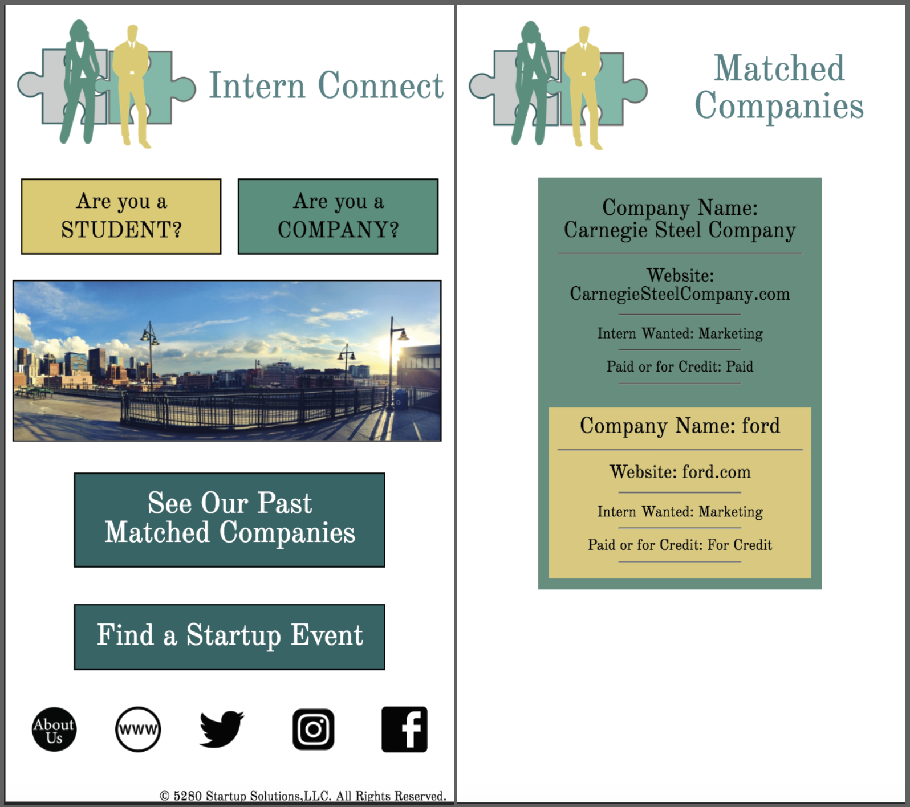
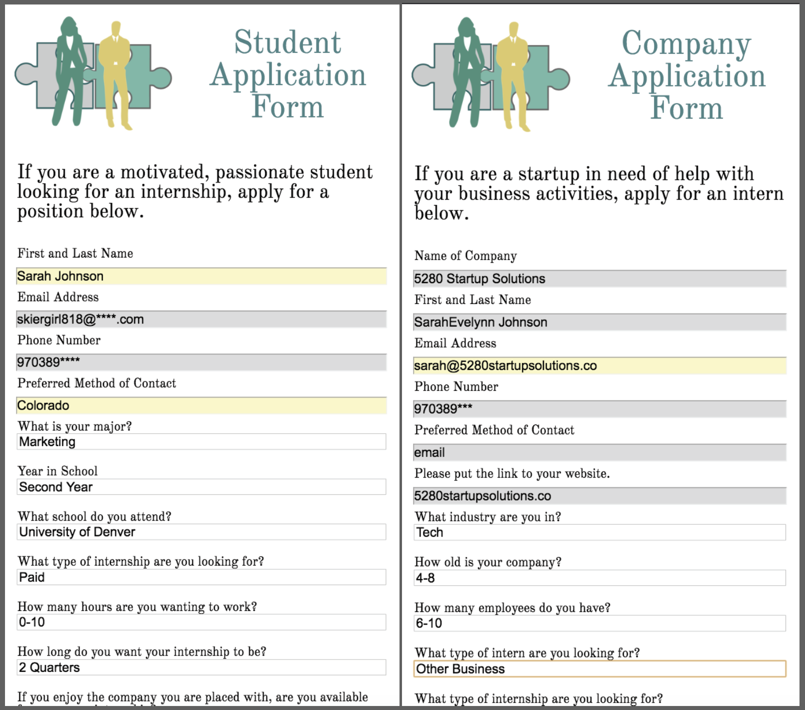

# InternConnect

### Author **SarahEvelynn Johnson**
### Contact **SarahEvelynnJohnson@gmail.com**

## Summary of App
This app allows for [5280 Startup Solutions, LLC](https://www.5280startupsolutions.co/) to keep track of their intern and internship applications. As the premier startup/internship matching company in Denver, it is difficult to keep track of what is happening with all of the companies and students while also running a consulting company.

### Student Resource
* Form to fill out for internship
    * Personal contact information
    * Information regarding school and area of study
    * Information regarding interest for what to work in
    * Ability to insert special links (website, social media, etc.)

### Company Resource
* Form to fill out for an intern
    * Name of Company and website
    * Person that is point of contact name and contact information
    * Type of intern (duties, payment and time period)

### Matching Board
* Way for students and companies to see which companies have previously been matched with an intern through 5280 Startup Solutions, LLC.

### Other Resources
* Link to Meetup to help people interested in startups have the resources needed to succeed.

## Preview of App

Links
[Deployed Site](https://intern-connect.firebaseapp.com/)
[Front-End Code](https://github.com/sarahevelynn/intern-connect-client)
[Back-End Code](https://github.com/sarahevelynn/intern-connect-server)

##Licensure
MIT License

Copyright (c) 2018 SarahEvelynn Johnson

Permission is hereby granted, free of charge, to any person obtaining a copy
of this software and associated documentation files (the "Software"), to deal
in the Software without restriction, including without limitation the rights
to use, copy, modify, merge, publish, distribute, sublicense, and/or sell
copies of the Software, and to permit persons to whom the Software is
furnished to do so, subject to the following conditions:

The above copyright notice and this permission notice shall be included in all
copies or substantial portions of the Software.

THE SOFTWARE IS PROVIDED "AS IS", WITHOUT WARRANTY OF ANY KIND, EXPRESS OR
IMPLIED, INCLUDING BUT NOT LIMITED TO THE WARRANTIES OF MERCHANTABILITY,
FITNESS FOR A PARTICULAR PURPOSE AND NONINFRINGEMENT. IN NO EVENT SHALL THE
AUTHORS OR COPYRIGHT HOLDERS BE LIABLE FOR ANY CLAIM, DAMAGES OR OTHER
LIABILITY, WHETHER IN AN ACTION OF CONTRACT, TORT OR OTHERWISE, ARISING FROM,
OUT OF OR IN CONNECTION WITH THE SOFTWARE OR THE USE OR OTHER DEALINGS IN THE
SOFTWARE.
